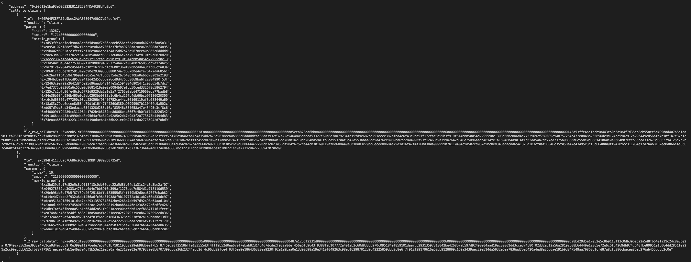
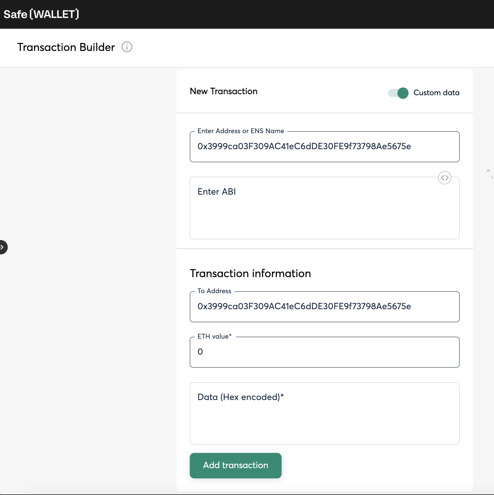
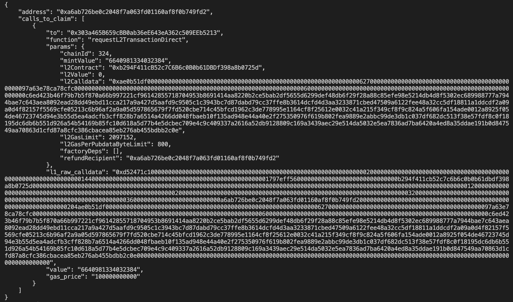
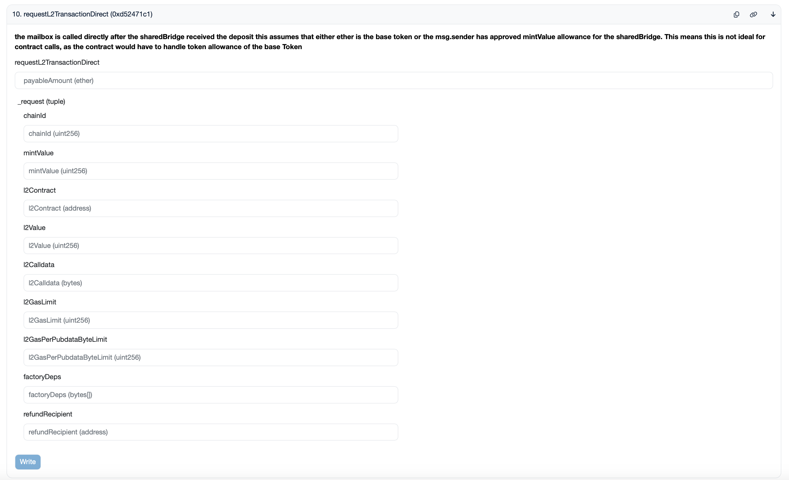
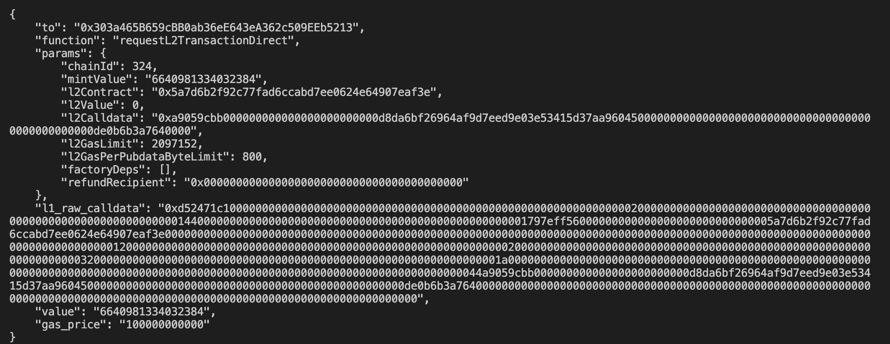

# Airdrop Claim Instructions

This README provides instructions for different types of eligible entities involved in the airdrop. There are four categories of eligibility, each corresponding to specific datasets of addresses and entities.

## Eligibility Categories

1. `eligibility_list.csv` - This includes a list of eligible blockchain addresses, encompassing:

    - Externally Owned Accounts (EOAs)
    - Native ZKsync smart contract wallets
    - ZKsync smart contracts (including Safes and DAOs)
    - Ethereum smart contracts (including Safes and DAOs)

2. `external_project_list.csv` - Contains the names of external projects that have been allocated part of the airdrop.

3. `github_repo_list.csv` - Lists GitHub repositories that are eligible for the airdrop.

4. `zksync_native_project_list.csv` - Features a list of ZKSync native projects that received an allocation.

## Table of Contents

- [Github accounts](#github-accounts)
- [L2 Addresses](#l2-addresses)
- [L1 Smart Contracts Addresses](#l1-smart-contracts-addresses)

## Github accounts

For GitHub repositories eligible for the airdrop as listed in `github_repo_list.csv`, each eligible GitHub account must be associated with a ZKsync or Ethereum address. After association, the address will be added to the final Merkle tree of eligible addresses, which is stored onchain. Users can claim through the official fronted using the provided address or manual instruction from this repo.

### Associating Your GitHub Account

To associate your GitHub account with your ZKsync or Ethereum address, please follow these steps:

1. Visit the Official Frontend:
    - Go to [Claim ZK nation Airdrop](https://claim.zknation.io).

2. Log in with GitHub:
    - Use your GitHub credentials to log into the frontend.

3. Link Your Blockchain Address:
    - Once logged in, follow the prompts to link your ZKsync or Ethereum address to your GitHub account.

### Deadlines for Association

There are two key deadlines for associating your GitHub account:

- First Deadline: June 14th, 15:00:00 CEST. Accounts associated before this date are added to the first Merkle distributor contract onchain, allowing claims to be started as early as June 17th.
- Second Deadline: June 24th 23:59:59 CEST. If your GitHub account completes the association before this date, your address will be added into the second claim period.

**Important**: After the second deadline, unassociated GitHub accounts will NOT be able to claim airdrop tokens, and their allocation may be forfeited.

## L2 Addresses

### Standard EOA Accounts

For standard externally owned accounts (EOAs), please use the official frontend for claiming your airdrop tokens. You can access the claiming interface at:

[Claim ZK nation Airdrop](https://claim.zknation.io)

### L2 Multisig or DAO Contracts

If you are claiming from an L2 multisig or DAO contract address, you need to make L2 transaction following these steps:

#### Contract Call Preparation:

Find the required transaction data in the pregenerated instructions. You can submit `claim` transaction using raw calldata or function parameters.

1. Clone the GitHub Repository and navigate to the `/claim-instructions` directory:
    - Run the following command in the terminal
    ```
    git clone https://github.com/ZKsync-Association/zknation-data.git && cd zknation-data/claim-instructions
    ```
2. Generate Transaction Parameters:
    - Install dependencies and run the script to generate L2 contract claim transaction parameters:
    ```
    yarn && yarn generate-l2-contract-claim-tx <address>
    ```



*Note*: The script return the array of claim transactions for each eligible distribution. If the address is eligible for only one distribution you will get one transaction instruction.

#### Claiming Process:

1. Use the block explorer frontend or suitable wallet interfaces that support contract interactions:
    - [Merkle Distributor Wave 1](https://era.zksync.network/address/0x66Fd4FC8FA52c9bec2AbA368047A0b27e24ecfe4#writeContract)
    - [Merkle Distributor Wave 2](https://era.zksync.network/address/0xb294F411cB52c7C6B6c0B0b61DBDf398a8b0725d#writeContract)
    - [Merkle Distributor Wave 3](https://era.zksync.network/address/0xf29D698E74EF1904BCFDb20Ed38f9F3EF0A89E5b#writeContract)
2. Execute the contract call with the generated calldata.

For example, if you are using Safe multisig, you can craft the transaction using the raw calldata in the Transaction Builder:



## L1 Smart Contracts Addresses

All eligible L1 addresses can claim through an L1 to L2 transaction requests and later control claimed funds. For those who want to use a more user-friendly L2 account, follow this two-step instruction to claim and then transfer to the specified L2 address:

### Contract Call Preparation:

#### CLI Output Description:

When you run the scripts, the CLI will output the following data:

- `address`: The address which claims.
- `to`: The address to call on L1.
- `function`: The name of the smart contract function to call.
- `params`: A JSON object detailing the transaction parameters and specifying the function to call.
- `l1_raw_calldata`: The calldata to be sent with the transaction.
- `value`: The amount in wei to send with the transaction.
- `gas_price`: The minimum gas price in wei to send transaction with.

#### 1. Claim tokens transaction

To claim tokens for an L1 contract, you need to first generate calldata. Unlike L2 execution, L1 to L2 calldata and the price for the transaction execution depend on network conditions. Therefore, use the provided script to generate the transaction parameters.

1. Clone the GitHub Repository and navigate to the `/claim-instructions` directory:
    - Run the following command in the terminal
    ```
    git clone https://github.com/ZKsync-Association/zknation-data.git && cd zknation-data/claim-instructions
    ```
2. Generate Transaction Parameters:
    - Install dependencies and run the script to generate L1 contract claim transaction parameters:
    ```
    yarn && yarn generate-l1-contract-claim-tx <address> [--l1-gas-price] [--l1-json-rpc]
    ```
    - `l1-gas-price` - Ethereum gas price in gwei, should be set to not less than the L1 gas price expected at the time of transaction execution.
    - `l1-json-rpc` - An optional parameter to specify the L1 node RPC URL.



*Note*: The script return the array of claim transactions for each eligible distribution. If the address is eligible for only one distribution you will get one transaction instruction.

#### Claiming Process:

1. Use the [block explorer](https://etherscan.io/address/0x303a465B659cBB0ab36eE643eA362c509EEb5213#writeProxyContract) frontend or suitable wallet interfaces that support contract interactions.
2. In the interface, fill out the function `requestL2TransactionDirect` with the following parameters from the generated output.
3. Execute the contract call with the generated calldata and the eligible address.

For example, if you connect your wallet on Etherscan, you can call the contract directly from the UI:
- Outputs from example above
    - `payableAmount (ether)` - 0.006640981334032384
    - `chainId` - 324
    - `mintValue` - 6640981334032384
    - `l2Contract` - 0xb294F411cB52c7C6B6c0B0b61DBDf398a8b0725d
    - `l2Value` - 0
    - `l2Calldata` - 0xae0b51df0000000000...bb2c0e *[shortened for this example]*
    - `l2GasLimit` - 2097152
    - `l2GasPerPubdataByteLimit` - 800
    - `factoryDeps` - []
    - `refundRecipient` - 0xa6ab726be0c2048f7a063fd01160af8f0b749fd2

*Note*: `payableAmount` means the ether amount to send with the transaction, which should be equal to the `value` field from the output converted from wei to ether.


#### 2. Transfer tokens to the specified address transaction

To transfer your claimed tokens to L2 account or another specified address, follow these steps to generate and execute the transfer transaction:

1. Generate Transaction Parameters:
    - Install dependencies and run the script to generate L1 contract claim transaction parameters:
    ```
    yarn && yarn generate-l1-contract-transfer-tx [--to] [--amount] [--l1-gas-price] [--l1-json-rpc]
    ```
    - `to` - The L2 recipient address for the ZK token transfer.
    - `amount` - The amount to be transferred, specified in raw format (not decimal). For example, to transfer 1 ZK token, if the token has 18 decimals, you should input 1000000000000000000.
    - `l1-gas-price` - Ethereum gas price in gwei, should be set to not less than the L1 gas price expected at the time of transaction execution.
    - `l1-json-rpc` - An optional parameter to specify the L1 node RPC URL.



#### Transfer Process:

1. Use the [block explorer](https://etherscan.io/address/0x303a465B659cBB0ab36eE643eA362c509EEb5213#writeProxyContract) frontend or suitable wallet interfaces that support contract interactions.
2. In the interface, fill out the function `requestL2TransactionDirect` with the following parameters from the generated output.
3. Execute the contract call with the generated calldata and the eligible address.

For example, if you connect your wallet on Etherscan, you can call the contract directly from the UI:
- Outputs from example above
    - `payableAmount (ether)` - 0.006640981334032384
    - `chainId` - 324
    - `mintValue` - 6640981334032384
    - `l2Contract` - 0x5a7d6b2f92c77fad6ccabd7ee062464907eaf3e
    - `l2Value` - 0
    - `l2Calldata` - 0xa9059cbb0000000000...3a7640000 *[shortened for this example]*
    - `l2GasLimit` - 2097152
    - `l2GasPerPubdataByteLimit` - 800
    - `factoryDeps` - []
    - `refundRecipient` - 0x0000000000000000000000000000000000000000

*Note*: `payableAmount` means the ether amount to send with the transaction, which should be equal to the `value` field from the output converted from wei to ether.

